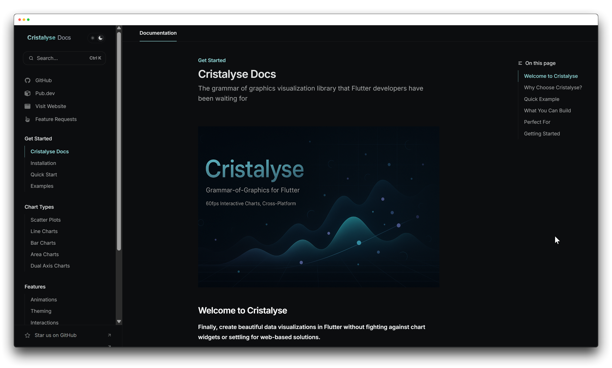
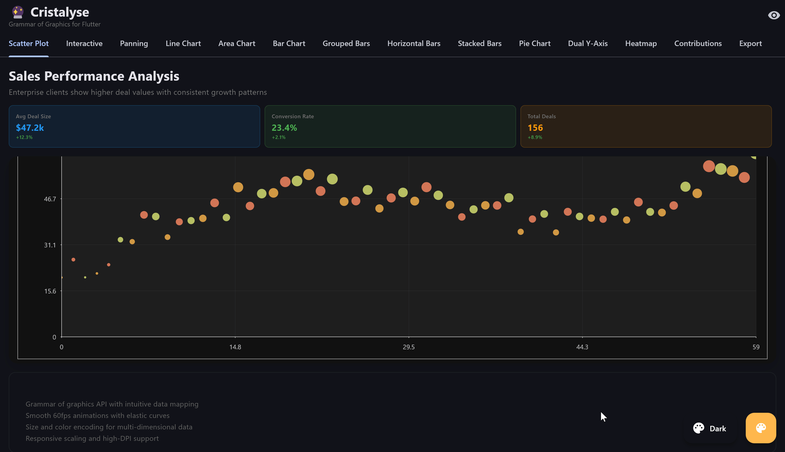

<p>
  <a href="https://docs.cristalyse.com">
    
  </a>
  <span>
    <a href="https://github.com/sponsors/rudi-q" style="float:right; margin-right: 300px">
      
    </a>
  </span>

**The grammar of graphics visualization library that Flutter developers have been waiting for.**
</p>


[](https://flutter.dev/)
[](https://dart.dev/)
[](https://pub.dev/packages/cristalyse)
[](https://pub.dev/packages/cristalyse/score)
[](https://pub.dev/packages/cristalyse/score)
[](https://opensource.org/licenses/MIT)

[](https://flutter.dev/)
[-145261?logo=webassembly&logoColor=white)](https://flutter.dev/)
[](https://flutter.dev/)
[](https://flutter.dev/)
[](https://flutter.dev/)
[](https://flutter.dev/)
[](https://flutter.dev/)

[](https://docs.cristalyse.com/cristalyse-mcp-server#claude-code-cli)
[](https://docs.cristalyse.com/cristalyse-mcp-server#ai-code-editor-cursor%2C-windsurf%2C-warp)
[](https://docs.cristalyse.com/cristalyse-mcp-server#ai-code-editor-cursor%2C-windsurf%2C-warp)
[](https://docs.cristalyse.com/cristalyse-mcp-server#ai-code-editor-cursor%2C-windsurf%2C-warp)

> Finally, create beautiful data visualizations in Flutter without fighting against chart widgets or settling for web-based solutions.

---

<table>
<tr>
<td width="45%">

<p align="center" style="padding-left: 5em;">
  <a href="https://docs.cristalyse.com">
    
  </a>
</p>

<p>
  <strong>Visit our complete documentation for step-by-step guides, interactive examples,<br/>and everything you need to master data visualization in Flutter.</strong>
</p>

<p align="center">
  <a href="https://docs.cristalyse.com">
    
  </a>
  &nbsp;&nbsp;
  <a href="https://docs.cristalyse.com/quickstart">
    
  </a>
</p>

<p align="center">
  <a href="https://docs.cristalyse.com/examples">
    
  </a>
  &nbsp;&nbsp;
  <a href="https://github.com/rudi-q/cristalyse">
    
  </a>
</p>

<p align="center">
  <a href="https://cristalyse.com">
    
  </a>
</p>

</td>
<td width="55%">

<p align="center">
  <a href="https://docs.cristalyse.com">
    
  </a>
  <br/>
  <em>Comprehensive guides, examples, and API reference</em>
</p>

</td>
</tr>
</table>

---

## 🤖 AI-Powered Development

**Cristalyse Docs now has MCP server** which you can connect to your AI coding assistant (Cursor, Windsurf, Warp, Claude) for instant access to documentation while you code.

<p align="center">
  <a href="https://docs.cristalyse.com/cristalyse-mcp-server">
    
  </a>
</p>

---

## ✨ Why Cristalyse?

**Stop wrestling with limited chart libraries.** Cristalyse brings the power of grammar of graphics (think ggplot2) to Flutter with buttery-smooth 60fps animations and true cross-platform deployment.

- 🎨 **Grammar of Graphics API** - Familiar syntax if you've used ggplot2 or plotly
- 🚀 **Native 60fps Animations** - Leverages Flutter's rendering engine, not DOM manipulation
- 📱 **True Cross-Platform** - One codebase → Mobile, Web, Desktop, all looking identical
- ⚡ **GPU-Accelerated Performance** - Handle large datasets without breaking a sweat
- 🎯 **Flutter-First Design** - Seamlessly integrates with your existing Flutter apps
- 📊 **Dual Y-Axis Support** - Professional business dashboards with independent left/right scales
- 📈 **Advanced Bar Charts** - Grouped, stacked, and horizontal variations with smooth animations
- 🫧 **Bubble Charts** - Multi-dimensional data visualization with size, color, and position encoding
- 👆 **Interactive Charts** - Engage users with tooltips, hover effects, and click events.

### See What You Can Build

<p align="center">
  
  <br/>
  <em>Interactive scatter plots with smooth animations and multi-dimensional data mapping</em>
</p>

<p align="center">
  
  <br/>
  <em>Progressive line drawing with customizable themes and multi-series support</em>
</p>

<table>
<tr>
<td width="50%">

## 🎯 Perfect For

- **Flutter developers** building data-driven apps who need more than basic chart widgets
- **Data scientists** who want to deploy interactive visualizations to mobile without learning Swift/Kotlin
- **Enterprise teams** building dashboards that need consistent UX across all platforms
- **Business analysts** creating professional reports with dual Y-axis charts and advanced visualizations
- **Product managers** tracking performance metrics across multiple dimensions with bubble charts

</td>
<td width="50%">

<p align="center">
  
  <br/>
  <em>Build stunning, interactive charts with the power of grammar of graphics</em>
</p>

</td>
</tr>
</table>

## 🚀 Quick Start

### Installation

```bash
flutter pub add cristalyse
```

That's it! No complex setup, no additional configuration.

### Your First Chart (30 seconds)

```dart
import 'package:cristalyse/cristalyse.dart';
import 'package:flutter/material.dart';

class MyChart extends StatelessWidget {
  @override
  Widget build(BuildContext context) {
    final data = [
      {'x': 1, 'y': 2, 'category': 'A'},
      {'x': 2, 'y': 3, 'category': 'B'},
      {'x': 3, 'y': 1, 'category': 'A'},
      {'x': 4, 'y': 4, 'category': 'C'},
    ];

    return CristalyseChart()
      .data(data)
      .mapping(x: 'x', y: 'y', color: 'category')
      .geomPoint(
        size: 8.0, // Made points a bit larger to see border clearly
        alpha: 0.8,
        shape: PointShape.triangle, // Example: use triangles
        borderWidth: 1.5,           // Example: add a border to points
      )
      .scaleXContinuous()
      .scaleYContinuous()
      .theme(ChartTheme.defaultTheme())
      .build();
  }
}
```

**Result:** A beautiful, animated scatter plot that works identically on iOS, Android, Web, and Desktop.

<p align="center">
  
  <br/>
  <em>Your first chart - clean, responsive, and cross-platform</em>
</p>

## 💡 Interactive Charts

### Enhanced Panning Behavior

**Real-time data streaming and interactive exploration** with advanced pan controls and coordinate transformation.

```dart
// Basic panning with range callbacks
CristalyseChart()
  .data(timeSeriesData)
  .mapping(x: 'timestamp', y: 'value')
  .geomLine()
  .interaction(
    pan: PanConfig(
      enabled: true,
      onPanUpdate: (info) {
        // Handle real-time updates based on visible X range
        print('Visible X range: ${info.visibleMinX} - ${info.visibleMaxX}');
        
        // Load more data when approaching boundaries
        if (info.visibleMaxX! > maxDataTimestamp - bufferTime) {
          loadMoreRecentData();
        }
      },
      throttle: Duration(milliseconds: 100), // Prevent overwhelming callbacks
    ),
  )
  .build();

// Advanced panning with state management
class PanningChartState extends State<PanningChart> {
  DateTime? visibleStart;
  DateTime? visibleEnd;
  
  @override
  Widget build(BuildContext context) {
    return Column([
      // Range display header
      Container(
        padding: EdgeInsets.all(8),
        child: Text(
          visibleStart != null 
            ? 'Range: ${DateFormat('MMM d').format(visibleStart!)} - ${DateFormat('MMM d').format(visibleEnd!)}'
            : 'Loading...',
        ),
      ),
      
      // Interactive chart
      Expanded(
        child: CristalyseChart()
          .data(chartData)
          .mapping(x: 'date', y: 'revenue')
          .geomLine()
          .onPan((info) {
            setState(() {
              visibleStart = DateTime.fromMillisecondsSinceEpoch(
                (info.visibleMinX! * 1000).round()
              );
              visibleEnd = DateTime.fromMillisecondsSinceEpoch(
                (info.visibleMaxX! * 1000).round()
              );
            });
            
            // Fetch data for new range
            fetchDataForDateRange(visibleStart!, visibleEnd!);
          })
          .build(),
      ),
    ]);
  }
}
```

**Panning Features:**
- ✅ **Coordinate Transformation** - Screen pixels to data values automatically
- ✅ **Throttled Callbacks** - Configurable update frequency for performance
- ✅ **Range State Persistence** - Maintains pan position across interactions
- ✅ **Real-time Data Loading** - Perfect for streaming and large datasets
- ✅ **Multi-axis Support** - Independent X and Y panning controls
- ✅ **Touch & Mouse Compatible** - Works on all platforms

Bring your data to life with a fully interactive layer. Add rich tooltips, hover effects, and click/tap events to give users a more engaging experience.

```dart
// Add tooltips and click handlers
CristalyseChart()
  .data(salesData)
  .mapping(x: 'week', y: 'revenue', color: 'rep')
  .geomPoint(size: 8.0)
  .interaction(
    tooltip: TooltipConfig(
      builder: (point) {
        // Build a custom widget for the tooltip
        final category = point.getDisplayValue('rep');
        final value = point.getDisplayValue('revenue');
        return Container(
          padding: const EdgeInsets.all(8),
          decoration: BoxDecoration(
            color: Colors.black.withOpacity(0.8),
            borderRadius: BorderRadius.circular(4),
          ),
          child: Text(
            '$category: \$$value k',
            style: const TextStyle(color: Colors.white, fontSize: 12),
          ),
        );
      },
    ),
    click: ClickConfig(
      onTap: (point) {
        // Handle tap event, e.g., show a dialog
        print('Tapped on: ${point.data}');
      },
    ),
  )
  .build();
```

## 🎬 See It In Action

### Animated Scatter Plot
```dart
CristalyseChart()
  .data(salesData)
  .mapping(x: 'date', y: 'revenue', color: 'region', size: 'deals')
  .geomPoint(alpha: 0.7)
  .animate(duration: Duration(milliseconds: 800), curve: Curves.elasticOut)
  .theme(ChartTheme.defaultTheme())
  .build()
```

### Multi-Series Line Chart
```dart
CristalyseChart()
  .data(timeSeriesData)
  .mapping(x: 'month', y: 'users', color: 'platform')
  .geomLine(strokeWidth: 3.0)
  .geomPoint(size: 4.0)
  .animate(duration: Duration(milliseconds: 1200))
  .theme(ChartTheme.darkTheme())
  .build()
```

### Combined Visualizations
```dart
CristalyseChart()
  .data(analyticsData)
  .mapping(x: 'week', y: 'engagement')
  .geomLine(strokeWidth: 2.0, alpha: 0.8)      // Trend line
  .geomPoint(size: 5.0, alpha: 0.9)            // Data points
  .animate(duration: Duration(milliseconds: 1000), curve: Curves.easeInOutCubic)
  .build()
```

## 📊 Advanced Bar Charts

<div align="center">
  
  
  <br/>
  <em>Vertical and horizontal bar charts with staggered animations</em>
</div>

### Stacked Bar Charts
```dart
// Perfect for budget breakdowns and composition analysis
CristalyseChart()
  .data(revenueData)
  .mapping(x: 'quarter', y: 'revenue', color: 'category')
  .geomBar(
    style: BarStyle.stacked,     // Stack segments on top of each other
    width: 0.8,
    alpha: 0.9,
  )
  .scaleXOrdinal()
  .scaleYContinuous(min: 0)
  .theme(ChartTheme.defaultTheme())
  .animate(duration: Duration(milliseconds: 1400))
  .build()
```

<p align="center">
  
  <br/>
  <em>Stacked bars with segment-by-segment progressive animation</em>
</p>

### Grouped Bar Charts
```dart
// Compare multiple series side-by-side
CristalyseChart()
  .data(productData)
  .mapping(x: 'quarter', y: 'revenue', color: 'product')
  .geomBar(
    style: BarStyle.grouped,     // Place bars side-by-side
    width: 0.8,
    alpha: 0.9,
  )
  .scaleXOrdinal()
  .scaleYContinuous(min: 0)
  .theme(ChartTheme.defaultTheme())
  .build()
```

<p align="center">
  
  <br/>
  <em>Grouped bar charts for comparing multiple series side-by-side</em>
</p>

### Horizontal Bar Charts & Coordinate Flipping
**Transform any vertical chart into horizontal** with coordinate system flipping.

```dart
// Horizontal bars - perfect for long category names and rankings
final departmentData = [
  {'department': 'Engineering', 'headcount': 45},
  {'department': 'Product Management', 'headcount': 25},
  {'department': 'Sales & Marketing', 'headcount': 35},
  {'department': 'Customer Success', 'headcount': 20},
  {'department': 'Human Resources', 'headcount': 15},
];

CristalyseChart()
  .data(departmentData)
  .mapping(x: 'department', y: 'headcount')
  .geomBar(
    borderRadius: BorderRadius.circular(4), // Rounded corners
    borderWidth: 1.0,                       // Add borders
    alpha: 0.8,
  )
  .coordFlip()                              // ✨ Flip to horizontal
  .scaleXOrdinal()
  .scaleYContinuous(min: 0)
  .theme(ChartTheme.defaultTheme())
  .build()

// Horizontal grouped bars for comparison
CristalyseChart()
  .data(quarterlyData)
  .mapping(x: 'quarter', y: 'revenue', color: 'region')
  .geomBar(style: BarStyle.grouped)
  .coordFlip()  // Makes grouped bars horizontal
  .legend(position: LegendPosition.bottomRight)
  .build()

// Horizontal stacked bars for composition
CristalyseChart()
  .data(budgetData)
  .mapping(x: 'category', y: 'amount', color: 'subcategory')
  .geomBar(style: BarStyle.stacked)
  .coordFlip()  // Horizontal stacked bars
  .scaleYContinuous(
    labels: NumberFormat.simpleCurrency().format,
  )
  .build()

// Horizontal scatter plot - useful for rank vs performance
CristalyseChart()
  .data(performanceData)
  .mapping(x: 'employee_name', y: 'performance_score', size: 'years_experience')
  .geomPoint()
  .coordFlip()  // Names on Y-axis, scores on X-axis
  .build()
```

**Coordinate Flipping Features:**
- ✅ **Universal Transformation** - Works with all chart types (bars, points, lines)
- ✅ **Automatic Axis Swapping** - X becomes Y, Y becomes X seamlessly  
- ✅ **Label Readability** - Perfect for long category names
- ✅ **Ranking Visualizations** - Natural top-to-bottom ranking display
- ✅ **Legend Compatibility** - Legends work perfectly with flipped coordinates
- ✅ **Animation Support** - Smooth animations work in both orientations

## 🏷️ Legends
**Automatic legend generation** from your color mappings with flexible positioning and styling.

```dart
// Automatic legend from color mapping
CristalyseChart()
  .data(salesData)
  .mapping(x: 'month', y: 'revenue', color: 'product') // Color mapping required
  .geomBar()
  .legend() // ✨ Auto-generates legend from 'product' categories
  .build();

// Positioned legend with custom styling
CristalyseChart()
  .data(revenueData)
  .mapping(x: 'quarter', y: 'amount', color: 'category')
  .geomBar(style: BarStyle.stacked)
  .legend(
    position: LegendPosition.right,
    orientation: LegendOrientation.vertical,
    backgroundColor: Colors.white.withOpacity(0.9),
    textStyle: TextStyle(fontSize: 12, fontWeight: FontWeight.w500),
    padding: EdgeInsets.all(12),
  )
  .build();

// Top horizontal legend for grouped bars
CristalyseChart()
  .data(productData)
  .mapping(x: 'quarter', y: 'revenue', color: 'product')
  .geomBar(style: BarStyle.grouped)
  .legend(
    position: LegendPosition.topRight,
    orientation: LegendOrientation.horizontal,
    spacing: 16.0,
    itemSpacing: 8.0,
  )
  .build();
```

**Legend Features:**
- ✅ **Auto-Generation** - Automatically creates legends from color mappings
- ✅ **Flexible Positioning** - Top, bottom, left, right, and corner positions
- ✅ **Custom Styling** - Background, text style, padding, and spacing control
- ✅ **Smart Layouts** - Automatic horizontal/vertical orientation based on position
- ✅ **Multi-Chart Support** - Works with all chart types that use color mapping
- ✅ **Responsive Design** - Adapts to container constraints

### Legend Positions
```dart
// Available positions
LegendPosition.top
LegendPosition.bottom  
LegendPosition.left
LegendPosition.right
LegendPosition.topLeft
LegendPosition.topRight
LegendPosition.bottomLeft
LegendPosition.bottomRight
```

## 🥧 Pie Charts and Donut Charts

**Perfect for part-to-whole relationships** - visualize market share, revenue distribution, user demographics, and any categorical data where proportions matter.

### Basic Pie Chart
```dart
// Revenue Distribution by Platform
CristalyseChart()
  .data([
    {'category': 'Mobile', 'revenue': 45.2},
    {'category': 'Desktop', 'revenue': 32.8},
    {'category': 'Tablet', 'revenue': 22.0},
  ])
  .mappingPie(value: 'revenue', category: 'category')
  .geomPie(
    outerRadius: 120.0,
    strokeWidth: 2.0,
    strokeColor: Colors.white,
    showLabels: true,
    showPercentages: true,
  )
  .theme(ChartTheme.defaultTheme())
  .animate(
    duration: Duration(milliseconds: 1200),
    curve: Curves.elasticOut,
  )
  .build()
```

### Donut Charts
```dart
// User Analytics with Donut Visualization
CristalyseChart()
  .data(userPlatformData)
  .mappingPie(value: 'users', category: 'platform')
  .geomPie(
    innerRadius: 60.0,        // Creates donut hole
    outerRadius: 120.0,
    strokeWidth: 3.0,
    strokeColor: Colors.white,
    showLabels: true,
    showPercentages: false,   // Show actual values
  )
  .theme(ChartTheme.darkTheme())
  .animate(
    duration: Duration(milliseconds: 1500),
    curve: Curves.easeOutBack,
  )
  .build()
```

### Advanced Pie Charts with Custom Styling
```dart
// Market Share Analysis with Exploded Slices
CristalyseChart()
  .data(marketShareData)
  .mappingPie(value: 'market_share', category: 'product')
  .geomPie(
    outerRadius: 150.0,
    strokeWidth: 2.0,
    strokeColor: Colors.white,
    showLabels: true,
    showPercentages: true,
    explodeSlices: true,      // Explode slices for emphasis
    explodeDistance: 15.0,
    labelRadius: 180.0,       // Position labels further out
    labelStyle: TextStyle(
      fontSize: 12,
      fontWeight: FontWeight.bold,
      color: Colors.black87,
    ),
  )
  .theme(ChartTheme.solarizedLightTheme())
  .build()
}
```

## 🔥 Heat Map Charts

**Perfect for 2D data visualization** - visualize correlations, performance matrices, time-based patterns, and any data with two categorical dimensions and a continuous value.

### Business Performance Heat Map
```dart
// Sales Performance by Region and Month
CristalyseChart()
  .data([
    {'month': 'Jan', 'region': 'North', 'sales': 85},
    {'month': 'Jan', 'region': 'South', 'sales': 62},
    {'month': 'Feb', 'region': 'North', 'sales': 93},
    {'month': 'Feb', 'region': 'South', 'sales': 78},
    // ... more data
  ])
  .mappingHeatMap(x: 'month', y: 'region', value: 'sales')
  .geomHeatMap(
    cellSpacing: 2.0,
    cellBorderRadius: BorderRadius.circular(4),
    colorGradient: [Colors.red, Colors.yellow, Colors.green],
    interpolateColors: true,
    showValues: true,
    valueFormatter: (value) => '${value.toInt()}%',
  )
  .theme(ChartTheme.defaultTheme())
  .animate(duration: Duration(milliseconds: 1500))
  .build()
```

### System Monitoring Heat Map
```dart
// Server Response Times by Hour and Service
CristalyseChart()
  .data(metricsData)
  .mappingHeatMap(x: 'hour', y: 'service', value: 'response_time')
  .geomHeatMap(
    minValue: 0,
    maxValue: 100,
    nullValueColor: Colors.grey.shade200,
    cellAspectRatio: 1.0,
    showValues: true,
    valueTextStyle: TextStyle(
      fontSize: 10, 
      fontWeight: FontWeight.bold,
    ),
  )
  .theme(ChartTheme.darkTheme())
  .build()
```

### Correlation Matrix
```dart
// Feature Correlation Analysis
CristalyseChart()
  .data(correlationData)
  .mappingHeatMap(x: 'variable1', y: 'variable2', value: 'correlation')
  .geomHeatMap(
    minValue: -1.0,
    maxValue: 1.0,
    colorGradient: [
      Colors.blue.shade800,   // Strong negative correlation
      Colors.white,           // No correlation  
      Colors.red.shade800,    // Strong positive correlation
    ],
    interpolateColors: true,
    cellSpacing: 1.0,
    showValues: true,
    valueFormatter: (value) => value.toStringAsFixed(2),
  )
  .build()
```

## 🎯 Dual Y-Axis Charts
**Perfect for business dashboards** - correlate volume metrics with efficiency metrics on independent scales.

```dart
// Revenue vs Conversion Rate - The Classic Business Dashboard
CristalyseChart()
  .data(businessData)
  .mapping(x: 'month', y: 'revenue')        // Primary Y-axis (left)
  .mappingY2('conversion_rate')             // Secondary Y-axis (right)
  .geomBar(
    yAxis: YAxis.primary,                   // Revenue bars use left axis
    alpha: 0.7,
  )
  .geomLine(
    yAxis: YAxis.secondary,                 // Conversion line uses right axis
    strokeWidth: 3.0,
    color: Colors.orange,
  )
  .geomPoint(
    yAxis: YAxis.secondary,                 // Points on conversion line
    size: 8.0,
    color: Colors.orange,
  )
  .scaleXOrdinal()
  .scaleYContinuous(min: 0)                 // Left axis: Revenue ($k)
  .scaleY2Continuous(min: 0, max: 100)      // Right axis: Percentage (%)
  .theme(ChartTheme.defaultTheme())
  .build()
```

<p align="center">
  
  <br/>
  <em>Dual axis charts for correlating two different metrics on independent scales</em>
</p>

### More Dual Y-Axis Examples

```dart
// Sales Volume vs Customer Satisfaction
CristalyseChart()
  .data(salesData)
  .mapping(x: 'week', y: 'sales_volume')
  .mappingY2('satisfaction_score')
  .geomBar(yAxis: YAxis.primary)            // Volume bars
  .geomLine(yAxis: YAxis.secondary)         // Satisfaction trend
  .scaleY2Continuous(min: 1, max: 5)        // Rating scale
  .build();

// Website Traffic vs Bounce Rate
CristalyseChart()
  .data(analyticsData)
  .mapping(x: 'date', y: 'page_views')
  .mappingY2('bounce_rate')
  .geomArea(yAxis: YAxis.primary, alpha: 0.3)    // Traffic area
  .geomLine(yAxis: YAxis.secondary, strokeWidth: 2.0) // Bounce rate line
  .scaleY2Continuous(min: 0, max: 100)      // Percentage scale
  .build();
```


## 🫧 Bubble Charts
**Perfect for market analysis and multi-dimensional data** - visualize three variables simultaneously with position and size encoding.

```dart
// Market Performance Analysis
CristalyseChart()
  .data([
    {'company': 'TechCorp', 'revenue': 250, 'customers': 180, 'marketShare': 28},
    {'company': 'StartupX', 'revenue': 85, 'customers': 120, 'marketShare': 12},
    {'company': 'MidSize', 'revenue': 150, 'customers': 160, 'marketShare': 18},
  ])
  .mapping(
    x: 'revenue',        // Revenue on X-axis
    y: 'customers',      // Customer count on Y-axis
    size: 'marketShare', // Market share determines bubble size
    color: 'category'    // Color by company category
  )
  .geomBubble(
    minSize: 8.0,        // Minimum bubble radius
    maxSize: 25.0,       // Maximum bubble radius
    alpha: 0.7,          // Semi-transparent bubbles
    borderWidth: 2.0,    // Border for definition
    showLabels: true,    // Show value labels
    labelFormatter: (value) => '${value}%', // Custom label format
  )
  .scaleXContinuous()
  .scaleYContinuous()
  .theme(ChartTheme.defaultTheme())
  .animate(duration: Duration(milliseconds: 1200))
  .build()
```

<p align="center">
  <em>Perfect for analyzing relationships between three continuous variables</em>
</p>

### Bubble Chart Features
- ✅ **Size Encoding** - Third dimension mapped to bubble radius
- ✅ **Color Grouping** - Categorical data with distinct colors  
- ✅ **Custom Labels** - Show formatted values on bubbles
- ✅ **Interactive Tooltips** - Rich hover information
- ✅ **Dual Y-Axis Support** - Use with secondary scales
- ✅ **Animation Support** - Smooth entrance effects

## 🔥 Current Features

### ✅ Chart Types
- **Scatter plots** with size and color mapping
- **Line charts** with multi-series support and progressive drawing
- **Area charts** with smooth fills and multi-series transparency
- **Bar charts** (vertical, horizontal, grouped, stacked) with smooth animations
- **Pie charts and donut charts** with exploded slices and smart label positioning
- **Heat map charts** with customizable color gradients and 2D data visualization
- **Bubble charts** with 3D data visualization and size encoding
- **Dual Y-axis charts** for professional business dashboards
- **Combined visualizations** (bars + lines, points + lines, etc.)

### ✅ Advanced Features
- **Grammar of Graphics API** - Familiar ggplot2-style syntax
- **Smooth 60fps animations** with customizable timing and curves
- **Dual Y-axis support** with independent scales and data routing
- **Multiple built-in themes** (Light, Dark, Solarized Light/Dark)
- **Custom color palettes** for brand-specific category mapping
- **Automatic legend generation** with flexible positioning and styling
- **Advanced label formatting** with NumberFormat integration
- **Interactive panning** with real-time data streaming support
- **Responsive scaling** for all screen sizes
- **High-DPI support** for crisp visuals

### ✅ Data Handling
- **Flexible data formats** - List<Map<String, dynamic>>
- **Mixed data types** - Automatic type detection and conversion
- **Missing value handling** - Graceful degradation for null/invalid data
- **Large dataset support** - Optimized for 1000+ data points
- **Real-time updates** - Smooth transitions when data changes
- **Multi-dimensional mapping** - X, Y, size, color encoding simultaneously

## 📸 Chart Export

**Export your charts as professional-quality SVG vector graphics** for reports, presentations, and documentation.

```dart
// Simple SVG export
final result = await chart.exportAsSvg(
  width: 1200,
  height: 800,
  filename: 'sales_report',
);
print('Chart saved to: ${result.filePath}');

// Advanced configuration
final config = ExportConfig(
  width: 1920,
  height: 1080,
  format: ExportFormat.svg,
  filename: 'high_res_dashboard',
);
final result = await chart.export(config);
```

**SVG Export Features:**
- ✅ **Scalable Vector Graphics** - Infinite zoom without quality loss
- ✅ **Professional Quality** - Perfect for presentations and reports
- ✅ **Small File Sizes** - Efficient for web and print
- ✅ **Design Software Compatible** - Editable in Figma, Adobe Illustrator, etc.
- ✅ **Cross-Platform Reliable** - Works consistently on all platforms
- ✅ **Automatic File Management** - Saves to Documents directory with timestamp

## 🎯 Real-World Examples

### Sales Dashboard
```dart
Widget buildRevenueTrend() {
  return CristalyseChart()
      .data(monthlyRevenue)
      .mapping(x: 'month', y: 'revenue', color: 'product_line')
      .geomLine(strokeWidth: 3.0)
      .geomPoint(size: 5.0)
      .scaleXContinuous()
      .scaleYContinuous(min: 0)
      .theme(ChartTheme.solarizedDarkTheme()) // Use Solarized Dark theme
      .animate(duration: Duration(milliseconds: 1500))
      .build();
}
```

### User Analytics
```dart
Widget buildEngagementScatter() {
  return CristalyseChart()
      .data(userMetrics)
      .mapping(x: 'session_length', y: 'pages_viewed',
      color: 'user_type', size: 'revenue')
      .geomPoint(alpha: 0.6)
      .scaleXContinuous()
      .scaleYContinuous()
      .theme(isDarkMode ? ChartTheme.darkTheme() : ChartTheme.defaultTheme())
      .animate(duration: Duration(milliseconds: 800), curve: Curves.elasticOut)
      .build();
}
```

### Market Share Analysis
```dart
Widget buildMarketSharePie() {
  return CristalyseChart()
      .data(marketData)
      .mappingPie(value: 'market_share', category: 'product')
      .geomPie(
        outerRadius: 140.0,
        strokeWidth: 3.0,
        strokeColor: Colors.white,
        showLabels: true,
        showPercentages: true,
        explodeSlices: true,                  // Emphasize key segments
        explodeDistance: 12.0,
        labelStyle: TextStyle(
          fontSize: 11,
          fontWeight: FontWeight.w600,
        ),
      )
      .theme(ChartTheme.defaultTheme())
      .animate(duration: Duration(milliseconds: 1200), curve: Curves.elasticOut)
      .build();
}
```

### Business Intelligence Dashboard
```dart
// Revenue bars + profit margin line on dual Y-axis
CristalyseChart()
  .data(kpiData)
  .mapping(x: 'quarter', y: 'revenue')
  .mappingY2('profit_margin')
  .geomBar(yAxis: YAxis.primary, style: BarStyle.stacked)
  .geomLine(yAxis: YAxis.secondary, color: Colors.green)
  .scaleYContinuous(labels: NumberFormat.simpleCurrency().format)
  .scaleY2Continuous(labels: (v) => '${v.toStringAsFixed(1)}%')
  .legend()
  .build();
```

### Advanced Multi-Geometry Dashboard
```dart
// Combined area + line + bubbles with dual Y-axis
CristalyseChart()
  .data(performanceData)
  .mapping(x: 'month', y: 'revenue', size: 'team_size', color: 'department')
  .mappingY2('efficiency')
  .geomArea(yAxis: YAxis.primary, alpha: 0.2)
  .geomLine(yAxis: YAxis.primary, strokeWidth: 3.0)
  .geomBubble(yAxis: YAxis.primary, minSize: 5.0, maxSize: 15.0)
  .geomLine(yAxis: YAxis.secondary, color: Colors.orange)
  .scaleYContinuous(labels: NumberFormat.compact().format)
  .scaleY2Continuous(labels: (v) => '${v.round()}%')
  .legend()
  .interaction(pan: PanConfig(enabled: true))
  .build();
```

## 💡 Why Not Just Use...?

| Alternative | Why Cristalyse is Better |
|-------------|---------------------------|
| **fl_chart** | Grammar of graphics API vs basic chart widgets. Dual Y-axis support vs single axis limitation. |
| **charts_flutter** | Active development vs deprecated. Stacked bars and advanced features vs basic charts. |
| **Web charts (plotly.js)** | Native performance vs DOM rendering. True mobile deployment vs responsive web. |
| **Platform-specific charts** | Write once vs write 3x for iOS/Android/Web. Consistent UX vs platform differences. |
| **Business tools (Tableau)** | Embedded in your app vs separate tools. Full customization vs template limitations. |

## 🛠 Advanced Configuration


### Animation Control
```dart
chart.animate(
  duration: Duration(milliseconds: 1200),
  curve: Curves.elasticOut,  // Try different curves!
)
```

### Custom Themes

**Complete visual control** with built-in themes and full customization options.

```dart
// Built-in themes
CristalyseChart()
  .data(data)
  .mapping(x: 'month', y: 'revenue')
  .geomLine()
  .theme(ChartTheme.darkTheme()) // or .defaultTheme(), .solarizedLightTheme()
  .build();

// Custom branded theme
final brandedTheme = ChartTheme(
  primaryColor: const Color(0xFF007BFF), // Brand primary
  colorPalette: [Colors.blue, Colors.green, Colors.red],
  axisTextStyle: const TextStyle(fontSize: 12, fontWeight: FontWeight.w500),
);

CristalyseChart()
  .theme(brandedTheme)
  .build();
```

**Theme Features:**
- ✅ **Built-in Themes** - Light, dark, and Solarized variants ready to use
- ✅ **Brand Customization** - Match your organization's visual identity
- ✅ **Responsive Design** - Adapt themes based on screen size
- ✅ **Color Palettes** - Comprehensive color schemes for multi-series charts
- ✅ **Typography Control** - Custom fonts, sizes, and weights
- ✅ **Layout Options** - Padding, spacing, and dimension control

### Custom Color Palettes

**Brand-specific colors for categories** with semantic meaning and consistent visual identity.

```dart
// Platform-specific colors
final platformColors = {
  'iOS': const Color(0xFF007AFF),
  'Android': const Color(0xFF3DDC84),
  'Web': const Color(0xFFFF6B35),
};

CristalyseChart()
  .data(appAnalyticsData)
  .mapping(x: 'month', y: 'users', color: 'platform')
  .geomLine()
  .customPalette(categoryColors: platformColors)
  .build();
```

**Custom Palette Features:**
- ✅ **Brand Consistency** - Use your organization's exact brand colors
- ✅ **Semantic Colors** - Map status, priority, or meaning to colors
- ✅ **Category Override** - Specific colors for individual categories
- ✅ **Fallback Support** - Unmapped categories use theme colors
- ✅ **Legend Integration** - Custom colors appear in auto-generated legends

### Advanced Label Formatting

**Professional number formatting** with NumberFormat integration and custom callbacks.

```dart
import 'package:intl/intl.dart';

// Currency formatting
.scaleYContinuous(labels: NumberFormat.simpleCurrency().format) // $1,234.56

// Compact notation
.scaleYContinuous(labels: NumberFormat.compact().format) // 1.2M, 5.6K

// Custom formatting
.scaleYContinuous(labels: (value) => '${value.toStringAsFixed(1)}°C') // 23.5°C
```

**Label Formatting Features:**
- ✅ **NumberFormat Integration** - Built-in currency, percentage, and compact formatting
- ✅ **Custom Callbacks** - Full control over label appearance and logic
- ✅ **Locale Support** - Automatic localization based on device settings
- ✅ **Multi-Chart Support** - Works with all chart types (axes, pie slices, bubbles)
- ✅ **Performance Optimized** - Efficient formatting without UI blocking
- ✅ **Unit Flexibility** - Easy addition of units, symbols, and custom text

### Advanced Data Mapping
```dart
// Map any data structure
chart
    .data(complexData)
    .mapping(
      x: 'timestamp',           // Time series
      y: 'metric_value',        // Numeric values  
      color: 'category',        // Color grouping
      size: 'importance'        // Size encoding
    )
    .mappingY2('efficiency')    // Secondary Y-axis for dual charts
```

### Stacked Bar Configuration
```dart
chart
    .data(budgetData)
    .mapping(x: 'department', y: 'amount', color: 'category')
    .geomBar(
      style: BarStyle.stacked,        // Stack segments
      width: 0.8,                     // Bar width
      borderRadius: BorderRadius.circular(4), // Rounded corners
      alpha: 0.9,                     // Transparency
    )
    .scaleXOrdinal()
    .scaleYContinuous(min: 0)
```

## 📱 Platform Support

- ✅ **iOS 12+**
- ✅ **Android API 21+**
- ✅ **Web (Chrome 80+, Firefox, Safari)**
- ✅ **Windows 10+**
- ✅ **macOS 10.14+**
- ✅ **Linux (Ubuntu 18.04+)**

## 🧪 Development Status

**Current Version: 1.6.1** - Production ready with comprehensive chart library featuring automatic legend generation, flexible positioning, and professional styling

We're shipping progressively! Each release adds new visualization types while maintaining backward compatibility.

- ✅ **v0.1.0** - Scatter plots and basic theming
- ✅ **v0.2.0** - Line charts and animations
- ✅ **v0.3.0** - Bar charts (including horizontal) and areas
- ✅ **v0.4.0** - Enhanced theming with custom colors and text styles, stacked bars
- ✅ **v0.5.0** - **Dual Y-axis support** and advanced bar chart variations
- ✅ **v0.6.0** - Interactive tooltips
- ✅ **v0.7.0** - Interactive panning
- ✅ **v0.8.0** - **Area chart support** with animations and multi-series capabilities
- ✅ **v0.9.0** - **Enhanced dual Y-axis SVG export** with comprehensive scale support
- ✅ **v1.0.0** - **Pie charts and donut charts** with exploded slices and smart label positioning
- ✅ **v1.1.0** - **Advanced label formatting system** with NumberFormat integration
- ✅ **v1.2.0** - **Heat map charts** with 2D data visualization and customizable color gradients
- ✅ **v1.3.0** - **Bubble charts** with 3D data visualization and professional size encoding
- ✅ **v1.4.0** - **Custom color palettes** for brand-specific category mapping
- ✅ **v1.5.0** - **Automatic legend generation** with flexible positioning and styling
- ✅ **v1.6.0** - **Experimental gradient color support** for customPalette with Linear, Radial, and Sweep gradients

## Support This Project

**Love Cristalyse?** Your support helps me dedicate more time to building the Flutter charting library you deserve!

<p>
  <a href="https://github.com/sponsors/rudi-q">
    
  </a>
</p>

### Why Sponsor?

- **Faster Development** - More features, bug fixes, and improvements
- **Better Documentation** - Comprehensive guides and examples
- **Priority Support** - Get your issues and feature requests prioritized
- **New Chart Types** - Help fund development of advanced visualizations
- **Platform Support** - Ensure continued cross-platform compatibility

### What Your Support Enables

**Active Development** - Cristalyse is passion project that requires significant time investment  
**Advanced Features** - Complex chart types like treemaps, sankey diagrams, and statistical overlays  
**Bug Fixes & Performance** - Rapid responses to issues and continuous optimization  
**Documentation & Examples** - Real-world examples and comprehensive tutorials  
**Community Building** - Discord server, workshops, and educational content  

<p align="center">
  <strong>Every contribution, no matter the size, makes a real difference!</strong>
</p>

---

## 🤝 Contributing

We'd love your help! Check out our [contributing guide](CONTRIBUTING.md) and:

- 🐛 Report bugs
- 💡 Suggest features
- 📝 Improve documentation
- 🔧 Submit pull requests

## 📄 License

MIT License - build whatever you want, commercially or otherwise.

## 🔗 Links

- 📦 [pub.dev package](https://pub.dev/packages/cristalyse)
- 📖 [Full documentation](https://github.com/rudi-q/cristalyse#readme)
- 🐛 [Issue tracker](https://github.com/rudi-q/cristalyse/issues)
- 💬 [Discussions](https://github.com/rudi-q/cristalyse/discussions)

---

**Ready to create stunning visualizations?** `flutter pub add cristalyse` and start building! 🚀

*Cristalyse: Finally, the grammar of graphics library Flutter developers deserve.*